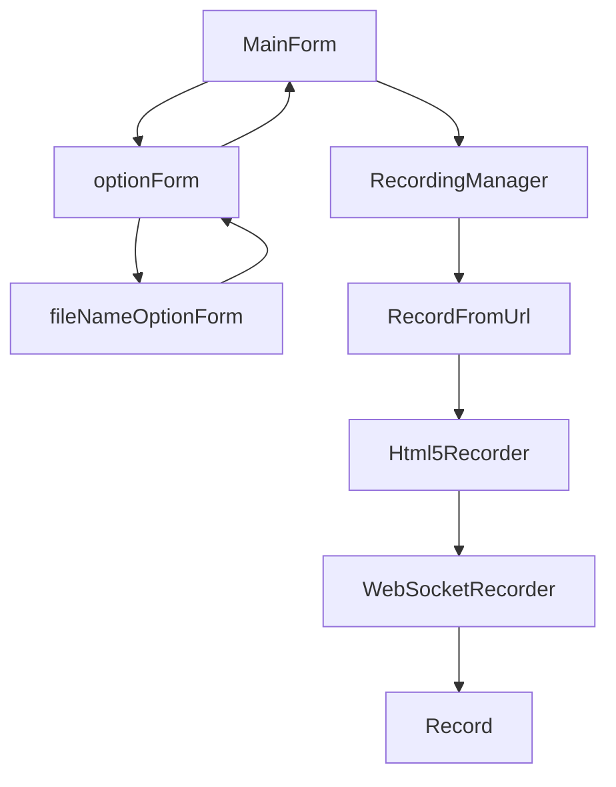

## ニコ生 新配信録画ツール（仮）

ニコ生のHLS新配信を録画するツールです。  
このツールを改良していただいても、もし参考になるところがあれば  
ソースを使って別のツールを作っていただいても構いません。
リファクタリング大歓迎です。

製作中に見つけた[ニコ生新配信の仕様](siyou.md)を記してみました。

## ライセンス
SnkLib.App.CookieGetter  
CookieGetterSharp  
<https://github.com/namoshika/SnkLib.App.CookieGetter>  
<https://github.com/namoshika/CookieGetterSharp>  
Copyright (c) 2014 halxxxx, うつろ  
Copyright (c) 2014 namoshika.    
Released under the GNU Lesser GPL  
halxxxx様、うつろ様、にょんにょん様、炬燵犬様  

WebSocket4Net  
<https://github.com/kerryjiang/WebSocket4Net>  
kerryjiang様  

ffmpeg  
<http://www.ffmpeg.org/>  
GNU Lesser General Public License (_LGPL_) version 2.1  

Json.NET  
<https://www.newtonsoft.com/json>  

## クラス
<dl>
  <dt>config</dt>
  <dd>config: 設定ファイルとのやりとり</dd>
  <dt>info</dt>
  <dd>ChatInfo: 受信したコメントを表す</dd>
  <dt>rec</dt>
  <dd>CookieGetter: Cookieの取得と同時にページの取得</dd>
  <dd>FollowCommunity: コミュニティのフォロー</dd>
  <dd>Html5Recorder: html5ページからの録画</dd>
  <dd>Record: ffmpegを使った録画</dd>
  <dd>RecordFromUrl: 録画開始前の放送状態の判定</dd>
  <dd>RecordingManager: 録画開始ボタンの動作定義的クラス</dd>
  <dd>RecordStateSetter.cs: 録画状況の表示</dd>
  <dd>WebSocketRecorder: WebSocket関係</dd>
  <dd>NotHtml5Recorder: 当初旧配信にも対応しようとしていた時の残り</dd>
  <dt>util</dt>
  <dd>util: 小さなメソッド群</dd>
  <dd>SourceInfoSerialize: ブラウザのCookie情報の保存と読み込み</dd>
  <dt>play</dt>
  <dd>Player: 録画しながら視聴するためにプレイヤーを実装しようとしていた頃の名残</dd>
  <dt>フォーム関係</dt>
  <dd>MainForm: メインフォーム</dd>
  <dd>optionForm: オプション画面のフォーム</dd>
  <dd>fileNameOptionForm: オプション画面中のファイル名設定のフォーム</dd>
</dl>

